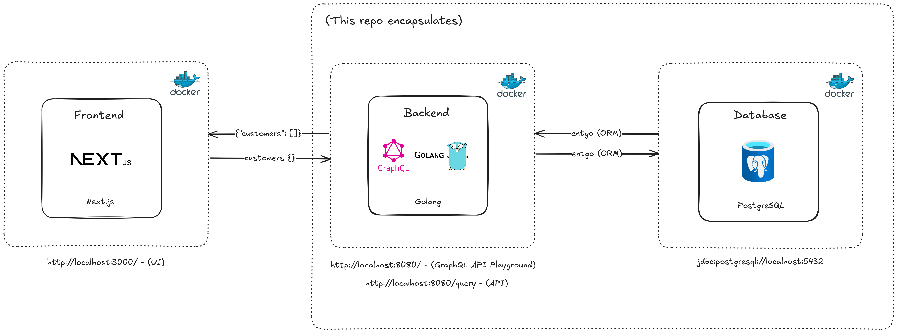

# IOHK Golang Backend

## Table of Contents
1. [Introduction](#introduction)
2. [Architecture Diagram](#architecture-diagram)
3. [Prerequisites](#prerequisites)
4. [Installation](#installation)
5. [Running Locally](#running-locally)
6. [Usage](#usage)
7. [Configuration](#configuration)
8. [Database Setup](#database-setup)
9. [Database Schema](#database-schema)
10. [GraphQL API Playground](#graphql-api-playground)
11. [Testing](#testing)
12. [Troubleshooting](#troubleshooting)
13. [Core Concepts](#core-concepts)
14. [Design Principles](#design-principles)
15. [Contributing](#contributing)
16. [Improvements](#improvements)
17. [Contact Information](#contact-information)

## Introduction

This project is a Golang-based backend application that serves as the API for a [Next.js frontend application](https://github.com/jw-cv/iohk-nextjs-frontend). It utilizes GraphQL for API queries and mutations and connects to a PostgreSQL database running inside a Docker container. The application is designed to be run locally in a Docker container to ensure there are no dependency issues.

## Architecture Diagram



## Prerequisites

Before you begin, please ensure you have the following installed:
- [Docker](https://docs.docker.com/get-docker/) (tested on 27.3.1, but should work on any version above 20.10)
- [Docker Compose](https://docs.docker.com/compose/install/) (tested on 2.29.7, but should work on any version above 2.0)
- [Make](https://www.gnu.org/software/make/) (tested on 4.3, but should work on any version above 3.81)
  - macOS: Included with Xcode Command Line Tools or alternatively via Homebrew with `brew install make`
  - Linux: Use your distribution's package manager (e.g., `sudo apt install make` for Ubuntu)
  - Windows: Install via [Chocolatey](https://chocolatey.org/install) with `choco install make`
- [Go](https://golang.org/doc/install) (tested on 1.23.1, but should work on any version above 1.20)

Please follow the links to find installation instructions for your specific operating system.

## Installation

1. Clone the repository and navigate to the project directory:
   ```
   git clone https://github.com/jw-cv/iohk-golang-backend.git
   cd iohk-golang-backend
   ```

2. Build the Docker images:
   ```
   make docker-build
   ```

This process will download all necessary Go dependencies and build the application within the Docker environment.

## Running Locally

To run the application locally:

1. Start the Docker containers:
   ```
   make docker-up
   ```

   This command will start both the PostgreSQL database and the Go application.


2. The application should now be running. You can access the GraphQL playground at [http://localhost:8080/playground](http://localhost:8080/playground). You can view some example queries and mutations in the [GraphQL API Playground](#graphql-api-playground) section.


3. To view the logs of the running containers (this is automatically run when you run `make docker-up`):
   ```
   make docker-logs
   ```

   This command will display the logs from all running containers. It's useful for debugging and monitoring the application's behavior.


4. To stop the application and all associated containers and volumes:
   ```
   make docker-down
   ```

Note: The application uses the `.env.local` file for configuration by default. If you need to modify any settings, you can edit this file before running `make docker-up`.

## Usage

This project uses a Makefile to simplify common operations. For a full list of available commands, run:

```
make help
```

Here are some useful commands:

- Start the Docker containers:
  ```
  make docker-up
  ```

- View Docker logs:
  ```
  make docker-logs
  ```

- Stop the Docker containers:
  ```
  make docker-down
  ```

- Run tests:
  ```
  make test
  ```

- Run test coverage:
  ```
  make coverage
  ```

- Run the integration tests

  ```
  make test-integration
  ```


## Configuration

The application uses environment variables for configuration. These are stored in the `.env.local` file. Here's an example of the required variables (you can change these to your liking but there is no need to change anything in order to run the application):

```
POSTGRES_USER=your_username
POSTGRES_PASSWORD=your_password
POSTGRES_DB=your_database_name
POSTGRES_HOST=localhost
POSTGRES_PORT=5432
POSTGRES_SSLMODE=disable
DB_MAX_CONNS=25
DB_MIN_CONNS=5
DB_MAX_CONN_LIFETIME=5h
DB_MAX_CONN_IDLE_TIME=15m
DB_HEALTH_CHECK_PERIOD=1m
APP_PORT=8080
```

## Database Setup

The PostgreSQL database is automatically set up when you run `make docker-up`. The initial schema and seed data are applied through the [init.sql](scripts/init.sql) file.

If you need to reset the database, you can run:

```
make docker-down
make docker-up
```

This will destroy the existing database and volumes and create a new one with the initial schema and seed data.

## Database Schema

The application uses a PostgreSQL database with a `customers` table. Below are the details of the table structure and constraints:

### Table Creation

```sql
-- Create the customer table
CREATE TABLE IF NOT EXISTS customers (
    id INT GENERATED ALWAYS AS IDENTITY PRIMARY KEY,
    name VARCHAR(100) NOT NULL,
    surname VARCHAR(100) NOT NULL,
    number INT NOT NULL,
    gender VARCHAR(15) NOT NULL CHECK (gender IN ('Male', 'Female')),
    country VARCHAR(50) NOT NULL,
    dependants INT NOT NULL DEFAULT 0 CHECK (dependants >= 0),
    birth_date DATE NOT NULL CHECK (birth_date <= CURRENT_DATE)
);
```

### Sample Data Insertion

```sql
-- Insert sample data into the customers table using TO_DATE to handle the MM/DD/YYYY date format
INSERT INTO customers (name, surname, number, gender, country, dependants, birth_date) VALUES
('Jack', 'Front', 123, 'Male', 'Latvia', 5, TO_DATE('10/3/1981', 'MM/DD/YYYY')),
('Jill', 'Human', 654, 'Female', 'Spain', 0, TO_DATE('6/2/1983', 'MM/DD/YYYY')),
('Robert', 'Pullman', 456, 'Male', 'Germany', 2, TO_DATE('5/4/1999', 'MM/DD/YYYY')),
('Chun Li', 'Suzuki', 987, 'Female', 'China', 1, TO_DATE('11/9/2001', 'MM/DD/YYYY')),
('Sarah', 'Van Que', 587, 'Female', 'Latvia', 4, TO_DATE('6/22/1989', 'MM/DD/YYYY'));
```

### Initial Schema and Seed Data

The following SQL script [init.sql](scripts/init.sql) is used to generate the initial schema and seed data when the PostgreSQL Docker container starts.


### Customer Table Checks


These checks ensure data integrity by enforcing rules such as:
- The birth date cannot be in the future
- The number of dependants cannot be negative
- The gender must be one of the predefined values: 'Male', 'Female'


## GraphQL API Playground

The GraphQL API can be explored using GraphQL Playground, which is available when running the application locally. You can perform CRUD (Create, Read, Update, Delete) operations on the customer data. To access it:

1. Start the application using `make docker-up`
2. Open a web browser and navigate to [http://localhost:8080/playground](http://localhost:8080/playground)
3. These changes will be reflected in the frontend application running at [http://localhost:3000](http://localhost:3000).

Here are some example operations you can perform (you can copy these into the playground and run them to generate new data and see the results on the frontend):

### Create a Customer

```
mutation CreateCustomer {
  createCustomer(input: {
    name: "John"
    surname: "Doe"
    number: 123
    gender: MALE
    country: "USA"
    dependants: 2
    birthDate: "1990-01-01"
  }) {
    id
    name
    surname
    number
    gender
    country
    dependants
    birthDate
  }
}
```

### Get All Customers

```
query GetAllCustomers {
  customers {
    id
    name
    surname
    number
    gender
    country
    dependants
    birthDate
  }
}
```

### Update a Customer

```
mutation UpdateCustomer {
  updateCustomer(
    id: "1", 
    input: {
      name: "Jane"
      surname: "Smith"
      number: 456
      gender: FEMALE
      country: "Canada"
      dependants: 1
      birthDate: "1985-05-15"
    }
  ) {
    id
    name
    surname
    number
    gender
    country
    dependants
    birthDate
  }
}
```

### Delete a Customer

```
mutation DeleteCustomer {
  deleteCustomer(id: "1")
}
```


## Testing

### Unit Tests

To run the unit test suite:

```
make test
```

This command will ensure all dependencies are downloaded and then run all the tests in the project.

To run tests with coverage:

```
make coverage
```

This will download dependencies if needed, run the tests, and generate a `coverage.html` file that you can open in your browser to view detailed coverage information.

Note: These tests run on bare metal and not in the Docker container.

### Integration Tests

To run the integration tests, which use Testcontainers to spin up a PostgreSQL database:

```
make test-integration
```

This command will:
- Start a PostgreSQL container using Testcontainers
- Run the integration tests
- Automatically tear down the container after tests complete

Note: Ensure Docker is running on your machine before running integration tests.

## Troubleshooting

- If you encounter issues with Docker, ensure that the Docker daemon is running on your machine.
- If you see database connection errors, check that the PostgreSQL container is running and that your `.env.local` file has the correct database credentials.
- For any Go-related issues, ensure that your Go version matches the one specified in the `go.mod` file.

## Core Concepts

### Domain-Driven Design (DDD) Architecture

This application follows DDD principles to separate business logic from infrastructure concerns.


### Repository Layer

The Repository layer interacts with the data store (e.g., database). Repositories are defined through interfaces to keep them testable. This layer handles technical errors such as database timeouts.

### Service Layer

The Service layer contains business logic. It processes user actions and can call other services. Errors here are logical and are meant for the end-user.

### Resolver Layer

Resolvers are responsible for handling GraphQL requests. They connect the GraphQL queries and mutations with the service layer. They are described in the [schema.graphqls](/graph/schema.graphqls) file. Resolvers handle data transmission errors, passing meaningful errors from the service layer to the API consumer. An interface for each type of action (Query, Mutation, Subscription) is using [gqlgen](https://gqlgen.com/). In this example, the implementation is done in the [resolver.go](/graph/resolver.go) file. For larger projects it might be a good idea to use multiple files instead.

## Design Principles

This project is built using Domain-Driven Design (DDD) principles and adheres to Test-Driven Development (TDD). Key design considerations:

-  Domain Driven Design (DDD): The application's domain layer is the core, with repository and service layers designed to keep business logic separate from infrastructure.
-  Test Driven Development (TDD): Unit tests were written to ensure that the business logic works as expected and as features are added, it ensures that the codebase remains robust and reliable. Integration tests simulate real-world usage, spinning up containers to test the PostgreSQL interactions.

## Contributing

1. Fork the repository
2. Create your feature branch (`git checkout -b feature/amazing-feature`)
3. Commit your changes (`git commit -m 'Add some amazing feature'`)
4. Push to the branch (`git push origin feature/amazing-feature`)
5. Open a Pull Request

Please adhere to the existing code style and include appropriate tests for new features.

Before submitting your Pull Request, please:
1. Ensure your code follows the project's coding standards
2. Update the documentation as necessary
3. Add or update tests to cover your changes
4. Ensure all tests pass locally

Please see my [Contact Information](#contact-information) below for any queries you may have.

## Improvements

- While the project is functional, there are several enhancements I would have liked to implement.
- Utilizing tools like [Hasura](https://hasura.io/) to automatically generate APIs and boilerplate code directly from the database schema would streamline development and maintain a single source of truth to enhance maintainability.
- Deploying the application to AWS, providing a live URL for easier access and testing.
- Setting up a CI/CD pipeline to automate testing, building, and deployment processes for continuous integration and delivery.
- Adding authentication, authorization, and additional features to the frontend to enhance security and user experience.
- There's always more that can be done to improve scalability, performance, and functionality!

## Contact Information

For any questions you may have, please feel free to contact me at [joshwillems.cv@gmail.com](mailto:joshwillems.cv@gmail.com).